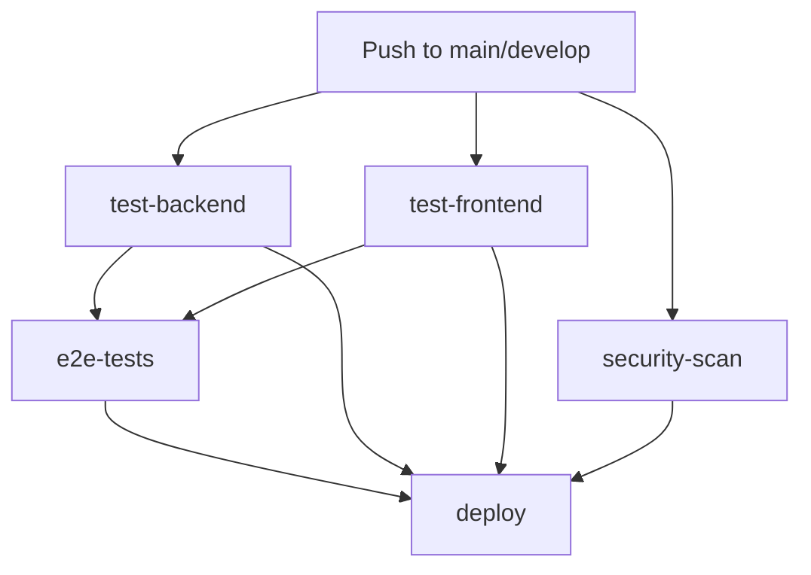

# Staff Management CI/CD Workflow Instructions

This document provides comprehensive instructions for the CI/CD pipeline setup and usage for the Staff Ma- `StaffManagement.Web/package.json` - Node.js dependencies (React 19.1, MUI, etc.)
- `StaffManagement.Web/package-lock.json` - Locked dependency versions
- `StaffManagement.E2E/package.json` - Playwright E2E test dependencies
- `*.csproj` files - .NET project configurations (.NET 8.0)
- `StaffManagement.sln` - Solution file containing all projectsent project.

## 📋 Overview

The CI/CD pipeline automatically builds, tests, and deploys the Staff Management application whenever code is pushed to the repository. The pipeline consists of several jobs that run in parallel and sequence to ensure code quality and successful deployment.

## 🏗️ Project Architecture

The Staff Management system is a modern web application with the following components:

- **StaffManagement.Api**: ASP.NET Core 8.0 Web API backend
- **StaffManagement.Web**: React 19.1 frontend with MUI (Material-UI)
- **StaffManagement.APP.Logic**: Business logic layer with Entity Framework
- **StaffManagement.SharedLib**: Shared models, DTOs, helpers, and utilities
- **StaffManagement.Tests**: Unit and integration tests with xUnit
- **StaffManagement.E2E**: Playwright end-to-end tests

## 🏗️ Pipeline Architecture



## 🚀 Pipeline Jobs

### 1. Backend Testing (`test-backend`)
- **Purpose**: Validates .NET API and business logic
- **Actions**:
  - Restores NuGet dependencies
  - Builds the entire solution (including API, Logic, SharedLib, and Tests projects)
  - Runs all unit and integration tests
- **Requirements**: .NET 8.0.x (configured in workflow)
- **Projects Tested**: 
  - StaffManagement.Api
  - StaffManagement.APP.Logic
  - StaffManagement.SharedLib
  - StaffManagement.Tests

### 2. Frontend Testing (`test-frontend`)
- **Purpose**: Validates React application
- **Actions**:
  - Installs npm dependencies using `npm ci`
  - Builds the React application for production
- **Requirements**: Node.js 18.x
- **Technologies**: React 19.1, MUI (Material-UI)
- **Coverage**: Builds application to verify functionality

### 3. End-to-End Testing (`e2e-tests`)
- **Purpose**: Tests the complete application flow
- **Actions**:
  - Starts the .NET API server on port 5009
  - Starts the React development server on port 3000
  - Runs Playwright E2E tests
  - Uploads test reports as artifacts
- **Dependencies**: Requires both backend and frontend tests to pass
- **Health Checks**: Validates both services are running before testing

### 4. Security Scanning (`security-scan`)
- **Purpose**: Scans for vulnerabilities in the codebase
- **Actions**:
  - Runs Trivy vulnerability scanner on filesystem
  - Uploads results to GitHub Security tab in SARIF format
- **Runs**: In parallel with other tests
- **Coverage**: Scans all project files for known vulnerabilities

### 5. Deployment (`deploy`)
- **Purpose**: Creates deployment artifacts for production
- **Actions**:
  - Builds optimized production versions of both backend and frontend
  - Creates deployment package with both components
  - Uploads artifacts for download
- **Trigger**: Only runs on `main` branch after all tests pass
- **Artifacts**: 
  - Backend: Published .NET application
  - Frontend: Optimized React build with production settings

## 🔧 Setup Instructions

### Prerequisites

1. **Repository Setup**:
   ```bash
   # Ensure your repository has the following structure:
   StaffManagement/
   ├── .github/workflows/ci-cd.yml
   ├── StaffManagement.sln
   ├── StaffManagement.Api/
   ├── StaffManagement.APP.Logic/
   ├── StaffManagement.SharedLib/
   ├── StaffManagement.Web/
   ├── StaffManagement.Tests/
   ├── StaffManagement.E2E/
   ├── scripts/
   │   ├── local-cicd.bat
   │   └── local-cicd.sh
   ├── package.json
   └── README.md
   ```

2. **Branch Protection**:
   - Go to Settings → Branches in your GitHub repository
   - Add branch protection rule for `main`
   - Require status checks to pass before merging
   - Require pull request reviews

### Environment Variables

The pipeline uses the following environment variables:

| Variable | Description | Default |
|----------|-------------|---------|
| `REACT_APP_API_BASE_URL` | API base URL for React app | `http://localhost:5009` (dev), `/api` (prod) |
| `CI` | Indicates CI environment | `true` |

### Required Secrets

No secrets are required for the basic pipeline. For deployment to specific platforms, you may need to add:

- `AZURE_CREDENTIALS` (for Azure deployment)
- `AWS_ACCESS_KEY_ID` / `AWS_SECRET_ACCESS_KEY` (for AWS deployment)
- `DEPLOY_TOKEN` (for custom deployment endpoints)

## 📝 Configuration Files

### 1. Main Workflow (`.github/workflows/ci-cd.yml`)

The main CI/CD pipeline configuration. Key sections:

```yaml
# Triggers
on:
  push:
    branches: [ main, develop ]
  pull_request:
    branches: [ main ]

# Jobs run in Ubuntu environment
runs-on: ubuntu-latest
```

### 2. Package Files

Ensure these files are present and up-to-date:

- `StaffManagement.Web/package.json` - Node.js dependencies (React 19.1, MUI, etc.)
- `StaffManagement.Web/package-lock.json` - Locked dependency versions
- `StaffManagement.E2E/package.json` - Playwright E2E test dependencies
- `*.csproj` files - .NET project configurations (.NET 8.0)
- `StaffManagement.sln` - Solution file containing all projects

## 🧪 Testing Locally

### Using the Local CI/CD Script

Run the complete pipeline locally:

**Windows:**
```cmd
.\scripts\local-cicd.bat
```

**Linux/macOS:**
```bash
chmod +x scripts/local-cicd.sh
./scripts/local-cicd.sh
```

### Manual Testing Steps

1. **Backend Tests**:
   ```bash
   # Restore dependencies for all projects
   dotnet restore StaffManagement.sln
   
   # Build the entire solution
   dotnet build StaffManagement.sln
   
   # Run unit and integration tests
   dotnet test StaffManagement.Tests/StaffManagement.Tests.csproj --verbosity normal
   ```

2. **Frontend Tests**:
   ```bash
   cd StaffManagement.Web
   
   # Install dependencies (clean install)
   npm ci
   
   # Build for production
   npm run build
   ```

3. **E2E Tests**:
   ```bash
   # Terminal 1: Start API (port 5009)
   dotnet run --project StaffManagement.Api/StaffManagement.Api.csproj --urls "http://localhost:5009"
   
   # Terminal 2: Start React app (port 3000)
   cd StaffManagement.Web
   set REACT_APP_API_BASE_URL=http://localhost:5009
   npm start
   
   # Terminal 3: Run E2E tests
   cd StaffManagement.E2E
   npm ci
   npx playwright install --with-deps
   npx playwright test
   ```

## 🚨 Troubleshooting

### Common Issues

#### 1. Build Failures

**Symptom**: `dotnet build` fails
**Solutions**:
- Check for missing NuGet packages: `dotnet restore`
- Verify .NET version compatibility
- Check for syntax errors in C# code

#### 2. Frontend Build Failures

**Symptom**: `npm run build` fails
**Solutions**:
- Delete `node_modules` and `package-lock.json`, then run `npm install`
- Check for TypeScript/JavaScript errors in the console
- Verify environment variables are set correctly (REACT_APP_API_BASE_URL)
- Ensure React 19.1 compatibility with all dependencies

#### 3. E2E Test Failures

**Symptom**: Playwright tests fail or timeout
**Solutions**:
- Verify both API (port 5009) and frontend (port 3000) are running
- Check for port conflicts with other applications
- Review Playwright configuration in `StaffManagement.E2E/playwright.config.js`
- Ensure proper health check endpoints are responding
- Check network connectivity between services

#### 4. Security Scan Issues

**Symptom**: Trivy scan fails or reports vulnerabilities
**Solutions**:
- Update dependencies to latest secure versions
- Review and acknowledge acceptable risks
- Add vulnerability exceptions if needed

### Debug Steps

1. **Check Workflow Logs**:
   - Go to Actions tab in GitHub
   - Click on failed workflow run
   - Expand failed job steps

2. **Local Debugging**:
   ```bash
   # Enable verbose logging
   dotnet build --verbosity detailed
   npm run build -- --verbose
   ```

3. **Dependency Issues**:
   ```bash
   # Clear all caches and rebuild
   dotnet clean StaffManagement.sln
   
   # Remove Node.js artifacts
   Remove-Item -Recurse -Force StaffManagement.Web/node_modules -ErrorAction SilentlyContinue
   Remove-Item StaffManagement.Web/package-lock.json -ErrorAction SilentlyContinue
   Remove-Item -Recurse -Force StaffManagement.E2E/node_modules -ErrorAction SilentlyContinue
   Remove-Item StaffManagement.E2E/package-lock.json -ErrorAction SilentlyContinue
   
   # Reinstall everything
   dotnet restore StaffManagement.sln
   cd StaffManagement.Web && npm install
   cd ../StaffManagement.E2E && npm install
   ```

## 📦 Deployment Artifacts

After successful pipeline execution, the following artifacts are created:

### Backend Artifact
- **Location**: `deployment/backend/`
- **Contents**: Published .NET application
- **Usage**: Deploy to IIS, Docker, or cloud hosting

### Frontend Artifact
- **Location**: `deployment/frontend/`
- **Contents**: Optimized React build
- **Usage**: Deploy to static hosting (Nginx, Apache, CDN)

### Download Artifacts

1. Go to Actions tab in GitHub
2. Click on successful workflow run
3. Scroll down to "Artifacts" section
4. Download `deployment-files.zip`

## 🔄 Workflow Triggers

### Automatic Triggers

- **Push to `main`**: Full pipeline + deployment
- **Push to `develop`**: Full pipeline (no deployment)
- **Pull Request to `main`**: Full pipeline (no deployment)

### Manual Triggers

You can manually trigger the workflow:

1. Go to Actions tab
2. Select "Staff Management CI/CD"
3. Click "Run workflow"
4. Choose branch and click "Run workflow"

## 📊 Monitoring and Reporting

### Test Results
- Unit test results appear in workflow logs
- E2E test reports are uploaded as artifacts

### Security Reports
- Vulnerability scans are uploaded to Security tab
- SARIF format reports for integration with GitHub Security

### Performance Monitoring
- Build times are tracked in workflow logs
- Artifact sizes are reported
- Test execution times are measured

## 🔧 Customization

### Adding New Test Steps

```yaml
- name: Custom Test Step
  run: |
    echo "Running custom tests..."
    # Your custom test commands
```

### Modifying Build Configuration

Edit `.github/workflows/ci-cd.yml`:

```yaml
# Change .NET version
- name: Setup .NET
  uses: actions/setup-dotnet@v4
  with:
    dotnet-version: '8.0.x'  # Currently using 8.0.x (update as needed)

# Change Node.js version
- name: Setup Node.js
  uses: actions/setup-node@v4
  with:
    node-version: '18'  # Currently using 18.x (update as needed)
```

### Adding Deployment Targets

```yaml
# Example: Deploy to Azure
- name: Deploy to Azure
  if: github.ref == 'refs/heads/main'
  uses: azure/webapps-deploy@v2
  with:
    app-name: 'your-app-name'
    publish-profile: ${{ secrets.AZURE_WEBAPP_PUBLISH_PROFILE }}
    package: './deployment'
```

## 📚 Additional Resources

- [GitHub Actions Documentation](https://docs.github.com/en/actions)
- [.NET CLI Reference](https://docs.microsoft.com/en-us/dotnet/core/tools/)
- [React Build Documentation](https://create-react-app.dev/docs/production-build/)
- [MUI Documentation](https://mui.com/material-ui/getting-started/)
- [Playwright Testing](https://playwright.dev/docs/intro)
- [Trivy Security Scanner](https://trivy.dev/)
- [ASP.NET Core Documentation](https://docs.microsoft.com/en-us/aspnet/core/)

## 🆘 Support

If you encounter issues:

1. Check this documentation first
2. Review workflow logs in GitHub Actions
3. Test locally using the provided scripts (`scripts/local-cicd.bat` or `scripts/local-cicd.sh`)
4. Check for known issues in the repository
5. Create an issue with detailed error information and logs

---

**Last Updated**: July 4, 2025
**Version**: 1.0
**Maintainer**: Development Team
